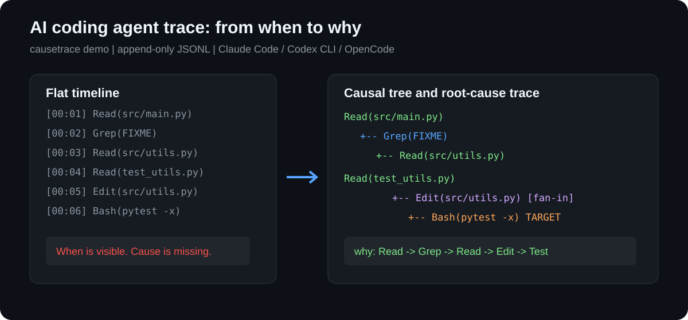

# causetrace

> [English](README.md) • [PyPI](https://pypi.org/project/causetrace/) • [变更日志](CHANGELOG.md) • [路线图](ROADMAP.md) • [讨论区](https://github.com/milkoor/causetrace/discussions) • [贡献指南](CONTRIBUTING.md) • [安全报告](SECURITY.md)

[](https://github.com/milkoor/causetrace/actions/workflows/ci.yml)
[](https://pypi.org/project/causetrace/)

**causetrace** 是面向 AI coding agents 的 Python tracing 与
observability 工具，支持 Claude Code、Codex CLI、OpenCode、Aider、
Continue.dev 和 GitHub Copilot。它捕获工具调用并链接成因果树与 DAG，
用于 agent 调试、回放、根因分析和行为解释，而非仅展示扁平时序线。

> **数据源**: Claude Code（hooks）、OpenCode / Continue.dev / GitHub Copilot（日志监听）、Codex CLI（rollout 解析）、Aider（进程包装）
> **存储**: `~/.causetrace/data/<session_id>.jsonl` — 追加写入 JSONL，零外部依赖

---

## 使用场景

- 追踪 AI coding agent 为什么进行了某次编辑或 shell 调用。
- 基于因果上下文调试 Claude Code hooks 与 Codex CLI rollout 会话。
- 按拓扑、工具转移和关键路径比较不同 agent 会话。
- 为 agent observability 研究收集已脱敏的运行时 trace。



---

## 功能展示

同一会话的四种视图 —— 扁平 vs. 因果。

### 时间线（扁平）

```
$ causetrace timeline ses_10d2f16e
[03:13:37] Read(file_path=src/main.py)
[03:13:37] Grep(pattern=FIXME)
[03:13:37] Read(file_path=src/utils.py)
[03:13:37] Read(file_path=src/utils.py)
[03:13:38] Edit(file_path=src/utils.py)
[03:13:38] Bash(command=python -m pytest tests/ -x)
[03:13:38] Grep(pattern=counter)
[03:13:38] Edit(file_path=docs/api.md)
[03:13:38] Bash(command=python -m pytest tests/)
```

按时间排序，但看不出"为什么"发生。

### 因果树

```
$ causetrace tree ses_10d2f16e
[03:13:37] Read(file_path=src/main.py)
    └─ [03:13:37] Grep(pattern=FIXME)
      └─ [03:13:37] Read(file_path=src/utils.py)
[03:13:37] Read(file_path=src/utils.py)  [caused by: need_context]
    └─ [03:13:38] Edit(file_path=src/utils.py)
      └─ [03:13:38] Bash(command=python -m pytest tests/ -x)
[03:13:38] Grep(pattern=counter)
    └─ [03:13:38] Edit(file_path=docs/api.md)
      └─ [03:13:38] Bash(command=python -m pytest tests/)
```

父子链揭示了因果结构：每个工具调用都是对其父节点的直接响应。

### 因果链追踪

```
$ causetrace why ses_10d2f16e <event_id>
[03:13:38] Grep(pattern=counter) ──→
[03:13:38] Edit(file_path=docs/api.md) ──→
[03:13:38] Bash(command=python -m pytest tests/) ◀── TARGET
```

追溯**某个事件为何发生** —— 从任意事件回溯因果链直至根因。

### 多父节点 DAG

```
$ causetrace graph ses_3e23bcc8
[02:42:40] Bash(command=python -m pytest tests/)  ← Edit(file_path=docs/api.md)
[02:42:41] Read(file_path=src/main.py)
[02:42:41] Grep(pattern=FIXME)  ← Read(file_path=src/main.py)
[02:42:41] Read(file_path=src/utils.py)  ← Grep(pattern=FIXME)
[02:42:41] Read(file_path=src/utils.py)
[02:42:41] Edit(file_path=src/utils.py)  ← Read(file_path=src/utils.py)
[02:42:41] Bash(command=python -m pytest tests/ -x)  ← Edit(file_path=src/utils.py)
[02:42:42] Grep(pattern=counter)
[02:42:42] Edit(file_path=docs/api.md)  ← Grep(pattern=counter)
```

扇入 DAG 展示汇聚因果关系 —— 一个工具消费了多个前置结果。通过逗号分隔的 `parent_event_id` 支持多父节点因果链接。

---

## 支持的 Agent

| Agent | 接入方式 | 原理 |
|-------|---------|------|
| **Claude Code** | Hook 桥接 | 通过 `~/.claude/settings.json` 的 PreToolUse/PostToolUse hooks |
| **OpenCode** | 日志监听 | 解析 `~/.local/share/opencode/log/*.log` 中的 tool.registry 条目 |
| **Aider** | 进程包装 | 以子进程运行 `aider`，从 stdout 解析工具调用 |
| **Continue.dev** | 日志监听 | 解析 `~/.continue/logs/core.log` 中的 JSON 工具调用条目 |
| **Codex CLI** | Rollout 解析 | 解析 `~/.codex/sessions/.../rollout-*.jsonl` — `function_call`/`function_call_output` 通过 `call_id` 配对 |
| **GitHub Copilot** | 日志监听 | 解析 `~/.config/Code/logs/` 中 Copilot 扩展的 host 日志 |

```bash
# Claude Code — Hook 自动记录
causetrace tree <session_id>

# Claude Code — 从 project 会话提取 reasoning 块
causetrace enrich-sessions
causetrace enrich <session_id> --save

# OpenCode — 从数据库会话提取 reasoning + 工具调用
causetrace enrich-opencode-sessions
causetrace enrich-opencode <session_id> --save

# Codex CLI — 从 rollout 会话构建因果链
causetrace enrich-codex-sessions
causetrace enrich-codex <session_id> --save

# 基于日志的 Agent — 扫描并保存（启发式因果推断）
causetrace opencode --save
causetrace continue --save
causetrace copilot --save

# Aider — 带追踪运行
causetrace aider -- --model gpt-4 --yes "修复这个bug"
```

使用说明：

- **Claude Code** — 精度最高，通过 Pre/Post hooks 捕获完整因果关系
- **Aider** — `causetrace aider --save -- [aider 参数]` 包装 CLI；从输出尽力解析
- **Codex CLI (enrich)** — 解析真实 rollout 格式：`function_call`/`function_call_output` 通过 `call_id` 配对
- **OpenCode (enrich)** — 从 SQLite DB 提取 reasoning + 工具调用，带因果父子链接
- **Continue.dev**、**Copilot** — 事后扫描日志；通过 `infer_relations()` 从时间邻近性推断因果关系
- **Codex CLI (`codex`)** — 为兼容保留的旧扫描路径；已验证的 rollout 导入请使用 `enrich-codex`
- 所有基于日志的 Agent 采用启发式因果推断 —— 事件间的时间戳决定父子链

---

## 快速开始

```bash
pip install causetrace

# 创建一个已保存的示例 trace，并直接查看因果树
causetrace demo
```

`demo` 会输出生成的 session ID 以及可直接执行的 `graph`、`why` 和
`stats` 命令，无需预先配置 agent 或下载 fixture。

### 接入 Claude Code

在保留已有 Claude Code 配置的前提下安装记录 hooks：

```bash
causetrace install-claude-hook
causetrace doctor
```

安装器首次修改前会创建 `~/.claude/settings.json.causetrace.bak` 备份。
运行 `causetrace uninstall-claude-hook` 可只移除 causetrace 管理的 hooks。

### 扫描 OpenCode 日志

```bash
causetrace opencode --save
```

解析 OpenCode 日志文件，从时间邻近性推断因果关系，并保存为 causetrace 会话。

### 分析与校验会话

```bash
causetrace validate <session_id>                 # 完整性与损坏 JSONL 校验
causetrace stats <session_id>                    # 拓扑汇总
causetrace roots <session_id>                    # 局部根节点与下游深度
causetrace critical-path <session_id>            # 最长局部因果链
causetrace patterns <session_id> --json          # 结构化模式输出
causetrace patterns <session_id> --csv           # 转移关系 CSV
causetrace annotate <session_id> --task-type bug_fix --success
causetrace compare <session_a> <session_b>
```

结构分析以当前加载的会话为边界：若父 ID 不在本会话内，其子事件会作为
局部根节点参与分析。`validate` 仍会将非 `root_` 的缺失父引用报告为警告。

### 已验证案例

- [Codex CLI rollout 解析案例](docs/case-studies/codex-rollout-parser.md)
- [Claude Code hook 因果链失效观察](examples/traces/failures/observations-claude-code-hooks.md)
- [运行时研究笔记](docs/research-notes/README.md)

---

## 数据模型

每个事件是一个 `ToolEvent`。四个因果字段（`parent_event_id`, `session_id`, `event_type`, `caused_by`）使 causetrace 区别于扁平日志系统。

| 字段 | 说明 |
|------|------|
| `event_id` | UUID |
| `parent_event_id` | 因果父节点（逗号分隔支持扇入，也可引用外部边界） |
| `session_id` | 所属会话 |
| `tool_name` | 例如 `Bash`、`Read`、`Write` |
| `tool_input` | 序列化的输入参数 |
| `tool_output` | 序列化的输出结果 |
| `timestamp` | ISO 8601 时间戳 |
| `duration_ms` | 执行耗时（毫秒） |
| `event_type` | `tool_call` / `reasoning` / `context_update` / `user_input` |
| `caused_by` | `user` / `reasoning` / event_id / 语义标签 |

---

## 命令参考

| 命令 | 说明 |
|------|------|
| `causetrace timeline <id>` | 扁平时间线 |
| `causetrace tree <id>` | 因果树 |
| `causetrace graph <id>` | 多父节点 DAG（扇入） |
| `causetrace sessions` | 列出所有会话 |
| `causetrace export <id>` | 导出 JSON |
| `causetrace replay <id>` | 回放溯源 |
| `causetrace why <id> <eid>` | 回溯因果链 |
| `causetrace enrich-sessions` | 列出 Claude Code project 会话 |
| `causetrace enrich <id> [--save]` | 从 Claude Code 会话提取 |
| `causetrace enrich-opencode-sessions` | 列出 OpenCode DB 会话 |
| `causetrace enrich-opencode <id> [--save]` | 从 OpenCode DB 会话提取 |
| `causetrace enrich-codex-sessions` | 列出 Codex CLI rollout 会话 |
| `causetrace enrich-codex <id> [--save]` | 从 Codex CLI rollout 提取 |
| `causetrace opencode [--save]` | 扫描 OpenCode 日志 |
| `causetrace aider [--save] -- [args]` | 带追踪运行 Aider |
| `causetrace continue [--save]` | 扫描 Continue.dev 日志 |
| `causetrace codex [--save]` | 旧版 Codex 扫描路径；优先使用 `enrich-codex` |
| `causetrace copilot [--save]` | 扫描 GitHub Copilot agent 日志 |
| `causetrace validate [<id>]` | 校验 JSONL、父引用和循环 |
| `causetrace stats [<id>]` | 展示拓扑统计 |
| `causetrace roots [<id>]` | 展示局部根节点及下游指标 |
| `causetrace critical-path [<id>]` | 展示最长局部因果链 |
| `causetrace patterns [<id>] [--json\|--csv]` | 分析因果路径和转移；CSV 输出转移表 |
| `causetrace annotate <id> [...]` | 保存任务/来源/结果侧车元数据 |
| `causetrace compare <a> <b>` | 对比两个会话的拓扑和转移 |
| `causetrace doctor` | 诊断 Agent 配置和数据源状态 |
| `causetrace demo` | 创建并查看自包含示例 trace |
| `causetrace install-claude-hook` | 安全配置 Claude Code 捕获 hooks |
| `causetrace uninstall-claude-hook` | 只移除 causetrace 管理的 hooks |

---

## 架构

```
┌──────────────┐  ┌──────────────┐  ┌──────────────┐  ┌──────────────┐  ┌──────────────┐  ┌──────────────┐
│ Claude Code  │  │   OpenCode   │  │    Aider     │  │ Continue.dev │  │  Codex CLI   │  │   Copilot    │
│  (hooks)     │  │ (log tail)   │  │ (subprocess) │  │ (log tail)   │  │ (log tail)   │  │ (log tail)   │
└──────┬───────┘  └──────┬───────┘  └──────┬───────┘  └──────┬───────┘  └──────┬───────┘  └──────┬───────┘
       │                 │                 │                 │                 │                 │
       ▼                 ▼                 ▼                 ▼                 ▼                 ▼
┌────────────────────────────────────────────────────────────────────────────────────────────────────┐
│                                    TraceRecorder                                                    │
│                              (因果链接、存储)                                                       │
└────────────────────────────────────────────────────────────────────────────────────────────────────┘
                                                │
                                                ▼
┌────────────────────────────────────────────────────────────────────────────────────────────────────┐
│                                           JSONStore                                                │
│                               (追加写入 JSONL, 无数据库)                                           │
└────────────────────────────────────────────────────────────────────────────────────────────────────┘
                                                │
                                                ▼
┌────────────────────────────────────────────────────────────────────────────────────────────────────┐
│                              Tree / DAG Builders                                                    │
│                              Renderers / ReplayEngine                                               │
└────────────────────────────────────────────────────────────────────────────────────────────────────┘
```

| 模块 | 职责 |
|------|------|
| `causetrace/core.py` | 数据模型、`TraceRecorder`、`JSONStore`、树/DAG 构建、渲染器、`ReplayEngine` |
| `causetrace/analysis.py` | 会话内拓扑、关键路径、窗口和因果模式分析 |
| `causetrace/annotation.py` | 用于标注和比较流程的侧车元数据 |
| `causetrace/causality.py` | 非结构化日志的时间因果推断 |
| `causetrace/cli.py` | argparse CLI，涵盖采集、分析、标注和诊断命令 |
| `causetrace/hooks/` | 各 Agent 的桥接与监听器 |
| `causetrace/hooks/claude_code.py` | Claude Code hook 桥接 |
| `causetrace/hooks/claude_project_parser.py` | Claude Code project 会话解析器 |
| `causetrace/hooks/opencode_parser.py` | OpenCode SQLite DB 会话解析器 |
| `causetrace/hooks/codex_parser.py` | Codex CLI rollout JSONL 解析器 |
| `causetrace/hooks/opencode_tailer.py` | OpenCode 日志监听 |
| `causetrace/hooks/aider_bridge.py` | Aider 子进程包装 |
| `causetrace/hooks/continue_tailer.py` | Continue.dev 日志监听 |
| `causetrace/hooks/codex_tailer.py` | Codex CLI 日志监听（旧版，建议用 enrich） |
| `causetrace/hooks/copilot_tailer.py` | GitHub Copilot 日志监听 |

---

## 开发

```bash
git clone https://github.com/milkoor/causetrace.git
cd causetrace
pip install -e ".[test]"
python -m pytest tests/ -v
```

---

## 许可

MIT
